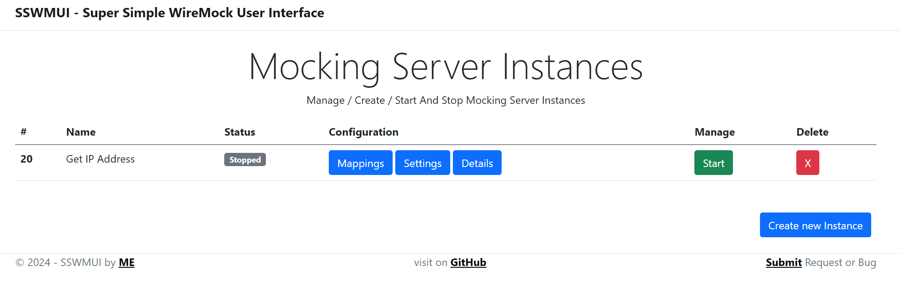
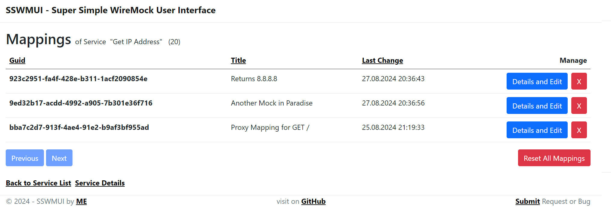

# TL;DR

_SSWMUI_ (Super Simple WireMock User Interface) is an ASP.NET Razor Page
making use of [WireMock.NET](https://github.com/WireMock-Net/WireMock.Net),
providing the possibility to create, start,
stop and configure web api proxy instances. You can edit and delete your mappings via a simple Webpage.
SSWMUI stores everything in a local database, with that, your service settings and mappings persist. You can even exchange the database to cover different scenarios, if you like.
In its current state it is super limited in its functionality but will grow continuously.

# How to use

## Start

### Get SSWMUI

First you must download the [latest](https://github.com/vanUbor/Wiremock/releases/latest) release 
directly form GitHub or download the image from the [Docker Hub](https://hub.docker.com/repository/docker/vanubor42/sswmui/general) 
(`docker pull vanUbor42/sswmui:latest`)

### Run

Just start the application, either your locally downloaded Wiremock.exe or run the docker image 
`docker run --name mySSWMUI -e ASPNETCORE_HTTP_PORTS=5000 -p 5000:5000 -p 8081:8081 vanubor42/sswmui`
and browse to the start page (by default <http://localhost:5000>).
On the start page you can see a list of services. Each service can mock the api calls to a configured web api endpoint.

Each row shows a service that is bound to a dedicated port. 
Besides a unique id, a name and the status of the service (running / stopped),
you can:

- start the service 
- stop the service
- delete the service
- edit the configuration of the service
- display the configuration of the service
- see all mappings of the service (mappings are explained down below)

### Record and Mock

Basically, what WireMock does is providing a "man in the middle" for Web API calls, recording them.
After it has recorded a call to an endpoint, it will not forward it again (on a second call), but answer "on its own".
Those recordings are called mappings. You can see a list of all mappings via the mappings button on each service row.
Now you can adjust the mappings to your needs and with that mock and external or your own Web API with ease.

## Configure

There are basically two different ways to configure a service.

### Admin API

As SSWMUI is basically just a super simple wrapper (providing a Web UI) around [WireMock.NET](https://github.com/WireMock-Net/WireMock.Net), 
you can just use the [Admin API](https://github.com/WireMock-Net/WireMock.Net/wiki/Admin-API-Reference) of WireMock.NET.
(by default each service starts with the Admin API enabled - you can disable it)

### Configuration Page

Each service has a very limited configuration page, you can access via the "Settings" button on each service row.
The settings should be self-explanatory, if not, please see WireMock.NET, as the settings are just 1:1 to the original. 

## Mappings

The Mapping page shows all active mappings on a service. You can configure the mappings via a json file in your browser.
To see details on how mappings work, see the [WireMock.NET WIKI](https://github.com/WireMock-Net/WireMock.Net/wiki)

# Code

## Build

## Quality

 

## Code Coverage

## Security

## Bugs & Issues

